## Gabor Implementation

`make_gabor_bank`
Creates a collection of Gabor filters using the setting in config file. For every combination of frequency, orientation and phase, it creates a Gabor kernel. Each kernel is then made zero-mean and normalized to unit norm. The function also stores the frequency, orientation and phase of each kernel as metadata.

`gabor_energy_maps`
Applies each Gabor filter to the grayscale image and converts its response into an energy map using either squared or absolute response. Pooling is used on the energy maps to produce more stable texture representations. The resulting maps are stacked into an H × W × K feature map, with one channel for each Gabor filter.

## Edge Implementation

`bilinear_sample`
Finds the pixel value at a coordinate that fall between pixels based on the four nearest pixels, through weighing how close the point is to each of the four pixels.

`nms_interpolated`
Makes the edges thinner. So for every pixel, check the pixel just ahead and just behind it using the direction the edge is pointing across. bilinear_sample is used to compute these pixels. If pixel if stronger than those two neighbours, we keep it, otherwise we set it to 0.

`adaptive_thresholds`
Decides what count as strong edge and what counts as week edge. Instead of picking a fixed number, looks at the actual pixel values in the image and calculates good cutoff points, using either percentile or median-based method

`hysteresis`
Connects broken edge lines. It starts at every strong edge pixel, then picks the neighbouring weak pixels, by checking either 4 or 8 neighbouring directions. If a weak pixel is connected to a strong one, keep it. Any weak pixel that isn't connected to a strong pixel gets thrown away.

## Features and Representations

`extract local features`
Extracts different types of visual information from an image and puts them into one feature map. It normalizes the image and converts to gray scale, extracts selected features, color, gabor features, gradient energy, edge density and edge orientation, then combine all features into one H × W × D feature map.

`global_pool`
Converts the local feature map into a one fixed-length vector. It flattens the spatial dimensions and calculates statistics such as mean, standard deviation and percentiles for each feature channel. These statistics are concatenated to produce a 1D feature vector.

`feature_family_indices`
Groups feature channels according to their type, such as colour, Gabor, gradient and edge families. It returns the indices belonging to each type in the vector.

## Normality Model

`select_mask_threshold`
Chooses the pixel F1 optimal threshold on public validation data only. It checks validation inputs before building candidate thresholds using evenly spaced quantile levels from 0.5 to 0.999. The function then calculate TP/FP/FN and F1 values for each threshold and select the best threshold that gives the largest F1 value.

`predict_anomaly`
Scores a new feature map against a fitted model. It first checks the feature map's dimension before calculating a pooled dense anomaly map, an image-level score (a percentile of the interior scores only), and a binary mask from thresholding. The function returns the scope map, the image score and the image mask.

`fit_normal_model`
Fits a per-feature diagonal Gaussian (mean and population std) from normal training feature maps. It validates inputs, flattens and concatenates all patches and sets a provisional threshold. It returns a NormalModel with float32 statistics.

`_interior`
Crops a score map by the number of variable border pixels on all aides to eliminate unreliable image edges. It would return a cropped map or an unchanged map if the border indicated is 0 or negative.

`_pool_score`
Smooths a score map with a box filter to supress isolated noisy patch responses while keeping spatially coherent anomalies visible.

`_score`
Computes a per-location anomaly score by standardizing each feature against the model's mean and standard deviation, before taking the root mean square across the feature dimension. It returns a float32 score map.

## Results and Analysis Task A-C

#### Question 1

Frequency determines the how tightly spaced the sine wave inside the kernel, higher frequency is used to detect finer features. The orientation rotates the direction of the sin curve. A response map having an orientation matching the direction of the texture will give higher response. Phase shifts where along the stripe the peak of the sine wave sits. Different phases can detect the same stripe at slightly different positions. One phase might detect the middle of the stripe, while another might detect its edge. Pooling size controls how much spatial averaging is applied to the energy map after the kernel response is computed. A small pooling window keeps the energy map sharp and localized while larger pooling window averages energy over a bigger neighbourhood, smoothing out the noise.

Case where large pooling increases stability: Carpet texture, since no two adjacent tufts will be identical even though the overall texture will be uniform. A large pooling window averages the noise away, giving a smooth and stable energy value.
For the same filter kernel, when pool_size=3, there are lots of small and high-contrast bright blobs scattered everywhere. When pool_size=15, those same small blobs have merged into broader, lower-contrast regions.

**Figure** Comparison of Gabor energy maps using pool sizes 3 and 15 for carpet texture.

Case when large pooling erases small features: Color defect on wood texture. If the pooling window is much larger than the scratch, then the scratch's energy will be diluted with surrounding pixels.
For the defect centre marked with x, at pool_size=3, the Gabor-energy map shows a clear, localized bright spot. Whereas at pool_size=21, defect's response has been diluted by the box filter.

**Figure** Comparison of Gabor energy maps using pool sizes 3 and 21 for wood texture with color defect.

#### Question 2

Used grid texture. Nearest-direction NMS breaks each ring into disconnected fragments, while interpolated NMS keeps each ring as one continuous loop. Nearest-direction NMS can only compare each pixel against neighbors along 4 fixed directions, but a ring has edge pixels pointing in every direction around its circumference. Directions not in the 4 fixed directions get suppressed. Interpolated NMS uses the exact angle via bilinear_sample, allowing it to keep the loop continuous.

**Figure** Nearest_direction NMS and Interpolated NMS for grid texture.

The histogram compares the distribution of surviving positive NMS values for both methods. Interpolated NMS retains a higher pixel count than nearest-direction NMS across most bins, particularly in the 0.06–0.09 range. This is consistent with the ring-fragmentation effect observed earlier.

**Figure** Retained positive response distribution for grid texture.

For the same grid texture image, in 8-connectivity edges, the rings are mostly complete, closed loops. Whereas in 4-connectivity edges, the same rings now have visible gaps. This is especially the case for diagonal portions of the ring.

**Figure** 8-Connectivity and 4-Connectivity for grid texture.

### Task A: Material Classification

**Setup.**
One descriptor per image was built with `extract_local_features` and `global_pool`. The `StandardScaler` + `LogisticRegression` pipeline was fitted on normal
MVTec training images only, [4 per material = 20 images]. It was evaluated on the full MVTec test split [248 images]

**Results.**
Accuracy was 0.940 and macro-F1 was 0.929.

Carpet and wood were classified perfectly. Leather and tile were nearly perfect (1 error each). Grid had recall of only 0.65: 5 grid images were predicted as carpet and 8 as tile.

**Figure** Confusion Matrix

On the left plot, most correct predictions are made with high confidence, concentrated in the 0.9-1.0 bin. Errors, however, split into two groups. Around half of the errors fall at 0.5-0.6 confidence and the other half occur at 0.9-1.0 confidence, so confidence alone cannot detect every mistake.

On the right plot, good and defective images have similar confidence distributions, with both concentrated at 0.9-1.0, consistent with their similar accuracy (0.938 vs 0.940). The larger defective bars reflect the larger number of defective test images (183 vs 65), not higher confidence. Defects therefore do not appear to reduce the classifier's confidence.

**Figure** Confidence Histogram

The largest bin (mean confidence ~0.95, accuracy~0.95) lies almost on the diagonal, and since it holds most of the test images. The overall calibration is good. The ~0.85 bin lies slightly above
the diagonal, the classifier is mildly under-confident there. The clear exception is the bin at mean confidence ~0.55, where accuracy was only ~0.15. Predictions in this range are strongly over-confident.

**Figure** Reliability Diagram

**Errors.**

Below are two examples of misclassification.

**Figure** Errors with the source image and response maps

#### Question 3

Largest values are the color channels (channels 0-2), where RGB is stored on 0 - 1 scale. Smallest values includes gabor channels (channels 11-14), such as those in the higher frequencies which might be due to the relatively smooth and low-frequency texture of wood and the gradient energy (channel 15), which is computed as a pooled energy. Scaling is required as a linear classifier will penalize cofficient magnitude uniformly across all features. Scaling helps to prevent cases where classifier underuses informative but small scale channels because of their units not their actual predictive value.

**Figure** Feature Channel Scale Comparison.

#### Question 4

Accuracy for good images: 0.938

Accuracy for defect images: 0.940

Classifier is not less accurate on images with defects.

The confident error idx=58 is a good grid image predicted as carpet with confidence 1.00. The below image shows its response maps against a correctly classified grid and carpet. Its edge-density map is dense across the whole image, like the carpet, whereas the grid reference has near-zero edge density over its top half. Its max-Gabor map shows strong regular stripes everywhere, and its gradient energy is spread evenly across the image.

**Figure** Example of a High Confidence Error.

### Task B

In task B, one normal model is fitted per material on training images only. Pixels thresholds are then selected on validation masks only per configuration. It would lastly freeze the selected threshold before scoig and evaluating the test split.

#### Comparison of Gabor, Edge only and Combined Maps

| Configuration | Threshold | Image AUROC | Pixel F1 | Pixel IoU |
| ------------- | --------- | ----------- | -------- | --------- |
| Gabor only    | 4.8237    | 0.694       | 0.167    | 0.091     |
| Edge only     | 3.0666    | 0.636       | 0.162    | 0.088     |
| Combined      | 3.4016    | 0.662       | 0.168    | 0.092     |

Gabor gives the best image-level detection (0.694), followed by combined (0.662) and edge (0.636). This might suggest that the edge map adds more noise than new information. In `features.py`, the combined configuration concatenates 3 colour, 4 Gabor and 6 edge channels. In `normality.py`, all channels are scored together using the root-mean-square of the per-channel z-scores. As a result, strong Gabor responses to a defect are averaged with mostly normal edge and colour responses, which reduces the defect contrast and makes it harder to separate defective from normal pixels. Since AUROC shows whether the model can identify defective images from normal ones, it makes sense that Gabor has the highest image AUROC and edge has the lowest.

There is no significant difference in pixel level localisation (pixel F1 and pixel IoU), which is very weak overall. This might be due to the high sigma (sigma = 3) over a 9x9 window. While smoothing may help in image detection (and possibly material defects) by supressing noise, it blurs precise pixel boundaries and hence results in low pixel level localisation. Nonetheless, combined maps performed the best for pixel level localisation.

#### IoU and F1 for each defect

Using the combined configuration with a threshold of 3.4016, the IoU and F1 results are shown in the table below. Good images without defects are left out as there are no defect pixels.

| Defect              | Material(s)             | Pixel F1  | Pixel IoU |
| ------------------- | ----------------------- | --------- | --------- |
| scratch             | wood                    | 0.583     | 0.412     |
| liquid              | wood                    | 0.530     | 0.360     |
| combined            | wood                    | 0.314     | 0.186     |
| color               | carpet / leather / wood | 0.307     | 0.181     |
| fold                | leather                 | 0.207     | 0.115     |
| glue                | leather / grid          | 0.196     | 0.109     |
| hole                | carpet / wood           | 0.134     | 0.072     |
| thread              | carpet / grid           | 0.087     | 0.045     |
| cut                 | carpet / leather        | 0.064     | 0.033     |
| poke                | leather                 | 0.027     | 0.014     |
| rough               | tile                    | 0.018     | 0.009     |
| glue_strip          | tile                    | 0.002     | 0.001     |
| metal_contamination | carpet / grid           | 0.000     | 0.000     |
| bent                | grid                    | 0.000     | 0.000     |
| broken              | grid                    | 0.000     | 0.000     |
| crack               | tile                    | 0.000     | 0.000     |
| gray_stroke         | tile                    | 0.000     | 0.000     |
| oil                 | tile                    | 0.000     | 0.000     |
| **Overall**         | all                     | **0.168** | **0.092** |

Likely connected edges: scratch, crack, cut, fold, thread, broken, bent. Thin edges are likely blurred away by the pooling (Gabor pool 7, edge density 9, score pool 7), and the strong regular pattern on tile and grid hides them.

Likely colour or diffuse texture: color, liquid, oil, glue, glue_strip, gray_stroke, rough, metal_contamination. Liquid and color do well because they are large, high-contrast regions, which suits the smoothed map. Oil, gray_stroke and rough (tile) score lowers as they are low-contrast against an already busy texture.

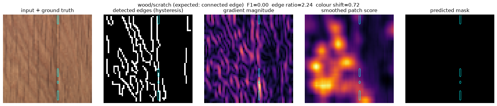

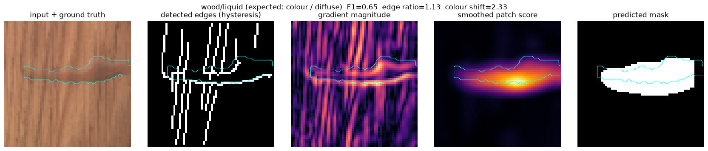

The above two images show the defects with the largest edge ratio and colour shift, which shows the most likely connected edges and most likely colour or diffuse textures respectively.

#### Question 5:

One failure caused by image borders is that the model performs badly along image edges. Removing a 5-pixel border from a 64×64 material image discards about 29% of the image, as a 54×54 region remains. The discarded region may contain information that is essential for identifying a defect, especially when the defect lies near the image edges.

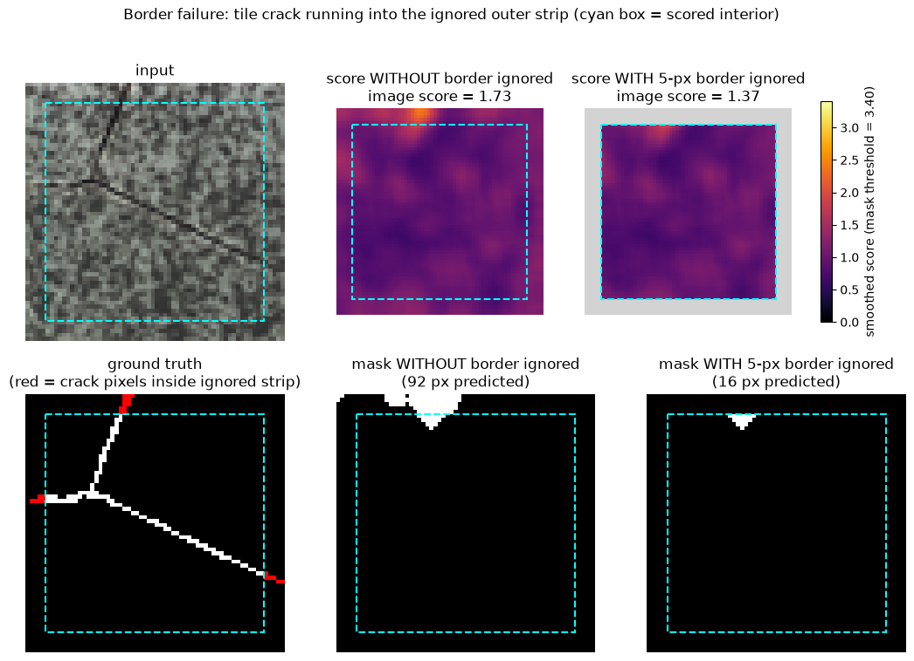

This is shown in the image above, where the defect goes undetected when the borders are removed, since the most significant portion of the crack appears to be in the border.

The aggregation percentile maps pixel scores into one number per image. It takes a predefined percentile of the pixel scores within the scored area. As the percentile increases, the image score is based on fewer, higher-scoring pixels. This is good for image-level detection of smaller defects, but it also gives high scores to bright lighting spots. However, it is lenient on bright lighting spots, which tend to give higher scores.

By raising the mask threshold, fewer pixels pass the threshold, so the mask gets smaller. Pixels where the score >= threshold are marked as defects. This is good for preventing irrelevant detection of minor defects, but it could miss real defects, especially faint ones such as threads and cuts.

### Task C

**Setup.**
We used 520 training and 520 validation images from DTD split 1 to predict 13 texture attributes. Images were resized to 64×64, features were extracted using Gabor, colour, gradient and edge features. A separate logistic regression model was trained for each attribute.

**Results.**
| Attribute | Average Precision (AP) | F1 Score |
|---|---:|---:|
| banded | 0.428 | 0.459 |
| blotchy | 0.193 | 0.000 |
| braided | 0.144 | 0.000 |
| bumpy | 0.159 | 0.043 |
| cracked | 0.122 | 0.000 |
| fibrous | 0.131 | 0.000 |
| grid | 0.252 | 0.237 |
| marbled | 0.214 | 0.000 |
| pitted | 0.081 | 0.000 |
| porous | 0.111 | 0.000 |
| stained | 0.178 | 0.068 |
| striped | 0.558 | 0.554 |
| woven | 0.334 | 0.179 |

The heatmap below shows the average predicted probability for each attribute, for images grouped by their primary label. The diagonal is highest for striped (0.50) and banded (0.35), moderate for grid and woven (0.24) and stained (0.21). Whereas braided, bumpy, fibrous, pitted and porous are much lower. Related regular patterns are confused: banded images receive a grid score of 0.21, and grid images receive striped (0.14) and woven (0.15) scores.

**Figure** Probability Heatmap.

**Qualitative examples**
Selected from the first validation image per primary class.

Example 1: (Success)
A banded image (labels: banded, striped) received banded p = ~0.80, above all other terms. It consists of thick, sharply separated vertical bands, producing strong, regular edges. However, stained received second highest with p = ~ 0.18.

Example 2: (High Scoring Error)
A striped image (labels: striped) recieved stained p = ~0.50, against striped p = ~0.08. The image contains large smooth colour regions of orange and blue next to fine surface ridges. The model may be reading the large colour regions as a stain-like pattern, while the stripes, which are curved and unevenly spaced, give weaker evidence.

Example 3: (With No Clear Evidence)
A stained image (labels: stained) received braided p = ~0.17 against stained p = 0.15, with every other score having a similar p. Model has no strong evidence for a certain term. Patterns of irregular dark and light patches would more generic features that resemble several terms.

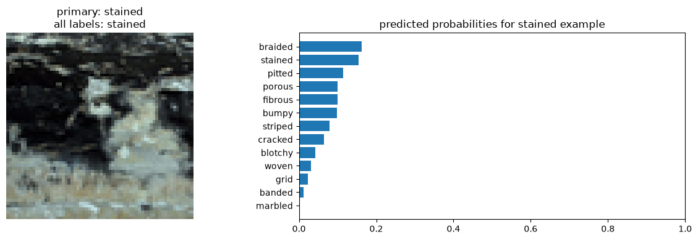

**Which attributes map to measurable evidence?**

Table: Average Precision by Feature Family for Each DTD Texture Attribute
| Attribute | Colour | Gabor | Gradient | Edge | All Features |
| --------- | -----: | ----: | -------: | ----: | -----------: |
| banded | 0.213 | 0.310 | 0.209 | 0.577 | 0.428 |
| blotchy | 0.149 | 0.162 | 0.139 | 0.160 | 0.193 |
| braided | 0.124 | 0.188 | 0.136 | 0.102 | 0.144 |
| bumpy | 0.128 | 0.143 | 0.153 | 0.087 | 0.159 |
| cracked | 0.092 | 0.087 | 0.089 | 0.100 | 0.122 |
| fibrous | 0.142 | 0.091 | 0.081 | 0.093 | 0.131 |
| grid | 0.131 | 0.205 | 0.134 | 0.240 | 0.252 |
| marbled | 0.183 | 0.155 | 0.135 | 0.097 | 0.214 |
| pitted | 0.080 | 0.152 | 0.120 | 0.077 | 0.081 |
| porous | 0.116 | 0.165 | 0.168 | 0.098 | 0.111 |
| stained | 0.143 | 0.149 | 0.107 | 0.131 | 0.178 |
| striped | 0.435 | 0.603 | 0.512 | 0.498 | 0.558 |
| woven | 0.203 | 0.163 | 0.219 | 0.274 | 0.334 |

Edge features perform best for banded (0.577), grid (0.240), and woven (0.274), while Gabor performs best for striped (0.603). This is reasonable because these textures contain clear lines or repeated patterns.
For some attributes, performance remains low across all feature families. Cracked, blotchy, bumpy, pitted and porous are close to chance, suggesting that our features do not capture their fine or irregular structures well.

#### Question 6

The descriptor contains colour, Gabor, gradient and edge features, summarised using mean, standard deviation and the 90th percentile. This captures colour variation, texture and edge information, which helps detect clear patterns such as striped (AP 0.558) and banded (AP 0.428) textures.
However, global pooling removes spatial information, so location of features or how they are arranged are not included. This may explain the poor results for cracked, braided and porous textures. The 64×64 grayscale images and local averaging may remove fine details and shading.

## Results and Analysis Task D

### Part 1 - Personal Photo Investigations

### Part 2 - VLM defect classification

#### Overall Results

This task test whether a virtual langauge machine can identify and name surface defects under 3 levels of supplied information. This comes in three levels: D1 generic one shot prompting, D2 named defect zero shot prompting and D3 example conditioned prompting.

The results for all five material under all three levels are documented in the table below:

| Query ID                                                                         | Condition | Predicted label     | Decision      | Confidence | Visible evidence                                                                                                                                                                                                                                                     | Exact prompt                                                                                                                                                                                                                                                                                                                                                                                                                                                                                                                                                                                                                                                         | Model / version                 | Run date   |
| -------------------------------------------------------------------------------- | --------- | ------------------- | ------------- | ---------- | -------------------------------------------------------------------------------------------------------------------------------------------------------------------------------------------------------------------------------------------------------------------- | -------------------------------------------------------------------------------------------------------------------------------------------------------------------------------------------------------------------------------------------------------------------------------------------------------------------------------------------------------------------------------------------------------------------------------------------------------------------------------------------------------------------------------------------------------------------------------------------------------------------------------------------------------------------- | ------------------------------- | ---------- |
| [taskD-D1-carpet](https://claude.ai/share/86358c68-f350-4de3-9ab4-c46e0da3af0d)  | color     | stain               | Defective     | 88         | A diffuse dark discoloration sits left of center in the lower half of the image (roughly x 320–480, y 590–740); it darkens the yarns without disturbing the regular plain-weave structure, which is consistent with a stain rather than a weave fault.               | "Inspect this surface image. Is anything visibly abnormal? Give a short defect name if abnormal, confidence from 0 to 100, and one sentence of visible evidence. Return JSON with `is_defective`, `defect_name`, `confidence`, and `evidence`."                                                                                                                                                                                                                                                                                                                                                                                                                      | Claude Opus 5.5 (Medium effort) | 2026-10-04 |
| [taskD-D1-grid](https://claude.ai/share/b0efd4d4-c2a9-4481-bb75-f639be926c26)    | broken    | broken mesh strands | Defective     | 95         | Two areas of the expanded metal mesh show broken strands, one in the upper center and one across the lower portion, where wires are severed with loose bent ends curling out and the regular diamond cells merge into enlarged open gaps.                            | (same as taskD-D1-carpet)                                                                                                                                                                                                                                                                                                                                                                                                                                                                                                                                                                                                                                            | Claude Opus 5.5 (Medium effort) | 2026-10-04 |
| [taskD-D1-leather](https://claude.ai/share/8b12a7f0-7c78-45b7-a86e-f7dce8d65ba4) | cut       | cut / puncture      | Defective     | 92         | Near the center-left of the brown grained leather, a short diagonal slit with a small torn, frayed opening exposing lighter underlying fibers breaks the otherwise uniform pebbled texture.                                                                          | (same as taskD-D1-carpet)                                                                                                                                                                                                                                                                                                                                                                                                                                                                                                                                                                                                                                            | Claude Opus 5.5 (Medium effort) | 2026-10-04 |
| [taskD-D1-tile](https://claude.ai/share/7f0ce88e-8e86-4727-88ab-751c58dcafe9)    | crack     | crack               | Defective     | 95         | A thin, dark, Y-shaped fracture line runs through the speckled tile surface, with two branches converging at the center and continuing as a single line to the bottom edge.                                                                                          | (same as taskD-D1-carpet)                                                                                                                                                                                                                                                                                                                                                                                                                                                                                                                                                                                                                                            | Claude Opus 5.5 (Medium effort) | 2026-10-04 |
| [taskD-D1-wood](https://claude.ai/share/d8cb767e-c2cc-45d8-b3b3-f0534b43c634)    | scratch   | crack               | Defective     | 72         | A continuous vertical split runs the full height of the panel just right of center, with frayed, lighter-colored exposed fibers along its left edge that differ from the surrounding grain.                                                                          | (same as taskD-D1-carpet)                                                                                                                                                                                                                                                                                                                                                                                                                                                                                                                                                                                                                                            | Claude Opus 5.5 (Medium effort) | 2026-10-04 |
| [taskD-D2-carpet](https://claude.ai/share/ffc9fc50-df12-4792-8729-5f051e2af961)  | color     | color               | Defective     | 85         | A dark, diffuse stain sits left of center in the lower half (roughly x 320–480, y 590–720), while the weave pattern runs unbroken through it, which points to discoloration rather than missing material or a cut.                                                   | "Here is a description of the above material image:  material: carpet color: A localized region has an abnormal colour or tone. cut: A sharp incision or sliced region interrupts the texture. hole: Material is missing in a compact hole-like region. metal_contamination: A metallic foreign object lies on the surface. thread: A foreign thread lies across the regular texture.  Inspect this surface image. Is anything visibly abnormal? Give a short defect name if abnormal, confidence from 0 to 100, and one sentence of visible evidence. Return JSON with `is_defective`, `defect_name`, `confidence`, and `evidence`."     | Claude Opus 5.5 (Medium effort) | 2026-10-06 |
| [taskD-D2-grid](https://claude.ai/share/e5e3a225-09a2-45dd-b2f6-7c07f676a513)    | broken    | broken              | Defective     | 90         | Several mesh strands are snapped with free curled ends near the upper center (around x 380–500, y 250–350) and in two places along the lower band (around x 80–220 and x 700–830, y 680–780), leaving enlarged open gaps in the otherwise regular diamond grid.      | "Here is a description of the above material image:  Q2 — grid bent: The regular grid lines are locally warped or displaced. broken: Part of the repeating grid is interrupted or missing. glue: A localized glue deposit changes the surface appearance. metal_contamination: A metallic foreign object lies on the surface. thread: A foreign thread lies across the regular texture.  Inspect this surface image. Is anything visibly abnormal? Give a short defect name if abnormal, confidence from 0 to 100, and one sentence of visible evidence. Return JSON with `is_defective`, `defect_name`, `confidence`, and `evidence`."   | Claude Opus 5.5 (Medium effort) | 2026-10-06 |
| [taskD-D2-leather](https://claude.ai/share/aa2afb84-bbac-47c4-9095-f635eb95a569) | cut       | poke                | Defective     | 72         | Left of center there is a small puncture-like opening exposing lighter, fibrous material, with a short dark diagonal crease leading into it, which breaks the otherwise uniform grain.                                                                               | "Here is a description of the above material image: material: leather color: A localized region has an abnormal colour or tone. cut: A sharp incision or sliced region interrupts the texture. fold: The surface is creased or folded out of its normal plane. glue: A localized glue deposit changes the surface appearance. poke: A small puncture-like indentation or opening is visible.  Inspect this surface image. Is anything visibly abnormal? Give a short defect name if abnormal, confidence from 0 to 100, and one sentence of visible evidence. Return JSON with `is_defective`, `defect_name`, `confidence`, and `evidence`." | Claude Opus 5.5 (Medium effort) | 2026-10-06 |
| [taskD-D2-tile](https://claude.ai/share/d2e65921-f9a8-439f-8022-8c4f42bdc134)    | crack     | crack               | Defective     | 93         | A thin, dark, Y-shaped fracture line runs from the top edge and converges into a single jagged line extending to the bottom of the speckled tile surface.                                                                                                            | "Here is a description of the above material image: material: tile crack: A narrow fracture-like line crosses the material surface. glue_strip: An elongated strip of adhesive lies on the tile. gray_stroke: A grey linear mark appears across the tile. oil: An oily region changes colour or reflectance. rough: A localized patch is visibly rougher than normal.  Inspect this surface image. Is anything visibly abnormal? Give a short defect name if abnormal, confidence from 0 to 100, and one sentence of visible evidence. Return JSON with `is_defective`, `defect_name`, `confidence`, and `evidence`."                        | Claude Opus 5.5 (Medium effort) | 2026-10-06 |
| [taskD-D2-wood](https://claude.ai/share/33ae8a73-d2bc-4d08-86f1-ffb7debe2dc9)    | scratch   | good                | Not Defective | 72         | The surface shows uniform oak-like grain with natural dark pore streaks and a straight vertical board joint, with no localized discoloration, stain, hole, or crossing scratch visible.                                                                              | "Here is a description of the above material image:  material: wood color: A localized region has an abnormal colour or tone. combined: More than one defect mechanism appears in the same image. hole: Material is missing in a compact hole-like region. liquid: A liquid stain changes colour or reflectance locally. scratch: A thin elongated abrasion crosses the surface.  Inspect this surface image. Is anything visibly abnormal? Give a short defect name if abnormal, confidence from 0 to 100, and one sentence of visible evidence. Return JSON with `is_defective`, `defect_name`, `confidence`, and `evidence`."          | Claude Opus 5.5 (Medium effort) | 2026-10-06 |
| [taskD-D3-carpet](https://claude.ai/share/523db719-4d5e-4dee-8e20-3582d003d6e7)  | color     | color               | Defective     | 72         | A diffuse dark stain sits in the lower-left-center (around x 330–480, y 590–720), where the weave stays intact but the yarns look abnormally dark, with no missing material, cut fibers, or raised foreign object.                                                   | (same as taskD-D2-carpet)                                                                                                                                                                                                                                                                                                                                                                                                                                                                                                                                                                                                                                            | Claude Opus 5.5 (Medium effort) | 2026-10-06 |
| [taskD-D3-grid](https://claude.ai/share/a06704cb-8e1b-413c-b8ae-219bf51f6a61)    | broken    | broken              | Defective     | 70         | In two regions (upper-center near x 380–500, y 250–350 and lower area near x 80–220 and x 690–830, y 680–780), grid strands end in free, curled tips and adjacent cells merge into enlarged openings, showing the repeating mesh is severed rather than only warped. | (same as taskD-D2-grid)                                                                                                                                                                                                                                                                                                                                                                                                                                                                                                                                                                                                                                              | Claude Opus 5.5 (Medium effort) | 2026-10-06 |
| [taskD-D3-leather](https://claude.ai/share/e65ed55e-3e85-4d9b-903b-56fe63298df9) | cut       | cut                 | Defective     | 85         | A thin diagonal slit runs from about (330, 570) to (420, 680) left of center, ending in a small opened gap with exposed lighter material, which matches the sharp incision in the 'cut' support example.                                                             | (same as taskD-D2-leather)                                                                                                                                                                                                                                                                                                                                                                                                                                                                                                                                                                                                                                           | Claude Opus 5.5 (Medium effort) | 2026-10-06 |
| [taskD-D3-tile](https://claude.ai/share/3d88c9c8-4634-4f3f-af0d-529373020a8f)    | crack     | crack               | Defective     | 97         | A thin, dark, sharp-edged fracture line runs down from the top and splits into a Y-shaped branch near the center, cutting across the speckled tile pattern just like the crack reference.                                                                            | (same as taskD-D2-tile)                                                                                                                                                                                                                                                                                                                                                                                                                                                                                                                                                                                                                                              | Claude Opus 5.5 (Medium effort) | 2026-10-06 |
| [taskD-D3-wood](https://claude.ai/share/4c467950-7b6a-4b7f-a422-4eca343c7f5e)    | scratch   | good                | Not Defective | 72         | The surface shows consistent oak grain and pore streaks with a single straight vertical board seam, and no localized discoloration, hole, liquid stain, or cross-cutting scratch is visible.                                                                         | (same as taskD-D2-wood)                                                                                                                                                                                                                                                                                                                                                                                                                                                                                                                                                                                                                                              | Claude Opus 5.5 (Medium effort) | 2026-10-06 |

The images used for D1 - D3 are as follows:
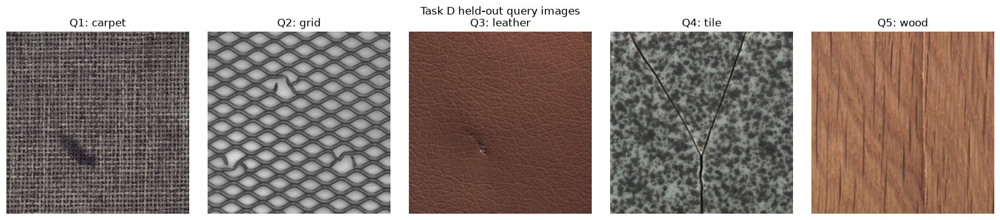

The validation support images used in D3 to identify the images are shown below as well:
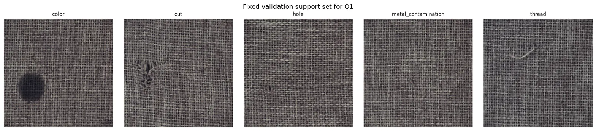
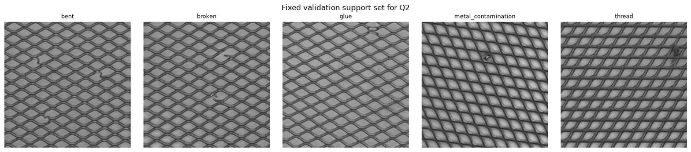
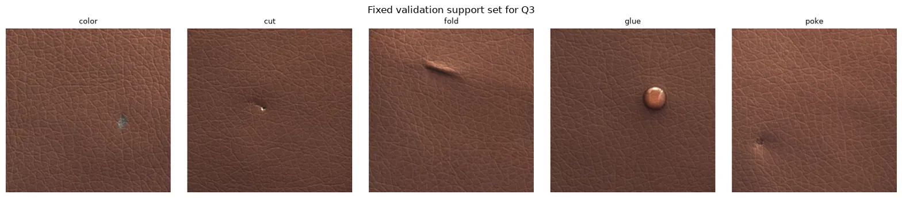
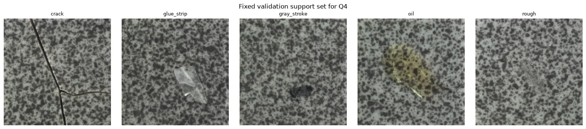
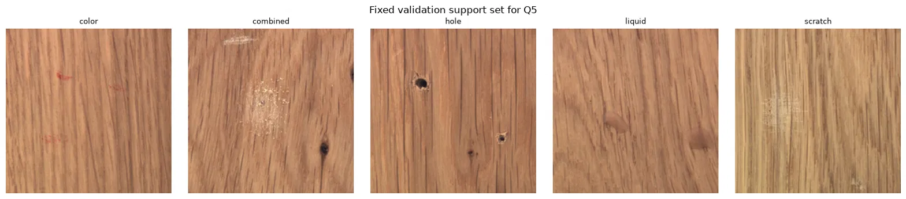

#### Analysis

This score table summarises the test results and accuracy:

| Condition             | Defect detected | Exact label | Lenient label | Mean confidence | Outside vocabulary      |
| --------------------- | --------------- | ----------- | ------------- | --------------- | ----------------------- |
| D1 generic zero-shot  | **5/5**         | 1/5         | 3/5           | 88.4            | 4/5 (free-form allowed) |
| D2 named definitions  | 4/5             | 3/5         | 3/5           | 82.4            | 1/5                     |
| D3 + support examples | 4/5             | **4/5**     | 4/5           | 79.2            | 1/5                     |

Exact labels are labels that match the defined correct label word for word. Lenient labels are labels that contain the exact label but include additional vocabulary (e.g., actual label: broken; predicted label: broken mesh strands). Exact labels are subset of lenient labels. The mean confidence score takes the average confidence values of each material under their respective conditions.

Without any label restrictions in D1, it detects all defects yet gives the lowest exact label accuracy. For instance, it detected the carpet abnomaly as stain instead of color and crack over scratch for wood. By giving definitions (D2) and examples (D3), the exact label accuracy increased from 1/5 to 3/5 and 4/5 respectively. However, it gave more false negatives by detecting wood as non defective in both D2 and D3. By adding supporting definitions and examples, it increases exact label accuracy but reduces defect detection recall. This drop in recall is limited as it pertains only to a single material defect (wood).

For D1, 4/5 of the labels violated the allowed vocabulary but no vocabulary violations are found in D2 and D3 where strict prompting and proper labels are in place.

#### Confidence Levels Plot

The confidence for correct, incorrect predictions are shown in the diagram below. For D1, lenient labels, labels that accurately identitfy the defect but uses additional vocabulary are identified too:

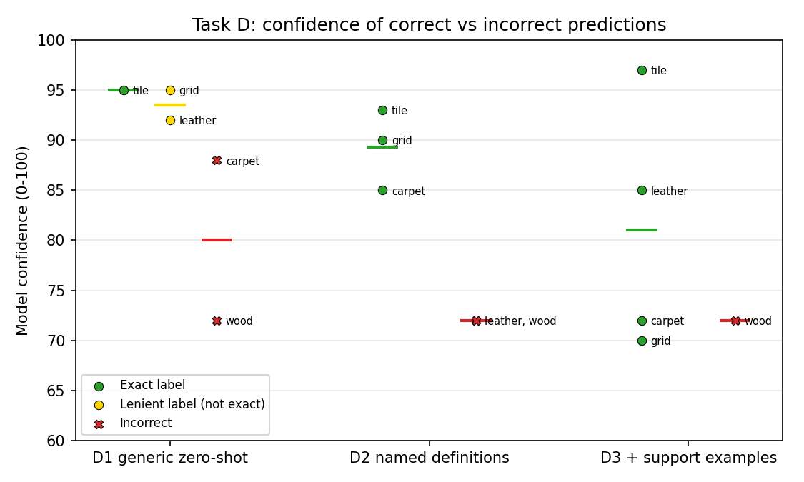

From the above diagram, the confidence levels are exact predictions are higher compared to incorrect predictions. This might be because of the overconfidence of LLMs, where in one study, it was recorded that LLMs overestimate the probability that their answer is correct between 20% and 60% (Sun et. al, 2025). With examples and defintions, LLMs have a source of reference and hence lower its confidence when their initial belief deviates from the facts provided.

#### Definitions and Examples in Output Predictions

Output prediction varies with the examples and definitions provided:

In the case of leather, examples helped, but definitions did not.
The model identified the defect as "poke" in D2, where only definitions were provided, whereas it had identified it as "cut/puncture" in D1, where neither definitions nor examples were given. Nonetheless, the prediction was corrected back to "cut" when example images were provided in D3.

There are no queries where the examples help yet the definition didn't, definitions play a critical role in identifying correct abnormalies when one of it is detected. For instance, in the case of carpet, the model initially predicted "stain" in D1, without any prompt guidance, but gave the correct label, "color," after definitions were provided in D2.

Nonetheless, both prompt and examples failed on wood. Without any definitions and examples, it correctly detected an abnormaly but gave the wrong label (crack instead of scratch). When definitions and examples were provided, the model did not detect any anomaly at all. This might be because the scratch is not prominent in the image; it is thin and close in colour to the wood, so it blends in with the surface. Compared with the definitions and examples, which tend to show more prominent defects, the scratch is far less obvious, so the model classified the image as having no defects.

#### Nondeterminism

The D2 prompt was re-run three times per material (leather, tile and wood) to check for nondeterminism. Each output is performed in a separate chat using Claude Opus 5.5 Medium on 6 October 2026. The results are shown below:

| Query ID                                                                            | Condition | Predicted label | Decision      | Confidence | Visible evidence                                                                                                                                                                                                                              |
| ----------------------------------------------------------------------------------- | --------- | --------------- | ------------- | ---------- | --------------------------------------------------------------------------------------------------------------------------------------------------------------------------------------------------------------------------------------------- |
| [taskD-D2-leather](https://claude.ai/share/aa2afb84-bbac-47c4-9095-f635eb95a569)    | cut       | poke            | Defective     | 72         | Left of center there is a small puncture-like opening exposing lighter, fibrous material, with a short dark diagonal crease leading into it, which breaks the otherwise uniform grain.                                                        |
| [taskD-D2-leather-v2](https://claude.ai/share/a02b4fb1-90e5-4e07-8c0a-766a180ab302) | cut       | poke            | Defective     | 78         | Left of center (around x 400, y 650) there is a small puncture-like opening with exposed lighter material and a slight dimpled depression, with a short torn line trailing up-left from it, interrupting the otherwise uniform pebbled grain. |
| [taskD-D2-leather-v3](https://claude.ai/share/6f04e339-f35a-4085-8c83-6147366df7a5) | cut       | poke            | Defective     | 82         | Left of center there is a small puncture-like opening with exposed lighter fibers and a short indented trail leading into it, breaking the otherwise uniform grain pattern.                                                                   |
| [taskD-D2-tile](https://claude.ai/share/d2e65921-f9a8-439f-8022-8c4f42bdc134)       | crack     | crack           | Defective     | 93         | A thin, dark, Y-shaped fracture line runs from the top edge and converges into a single jagged line extending to the bottom of the speckled tile surface.                                                                                     |
| [taskD-D2-tile-v2](https://claude.ai/share/9dce76f2-1726-4b35-8278-beb7da3f5d4d)    | crack     | crack           | Defective     | 92         | A thin, dark, irregular Y-shaped fracture line runs from the top edges and merges into a single line extending down to the bottom of the speckled tile surface.                                                                               |
| [taskD-D2-tile-v3](https://claude.ai/share/583dc1d4-4bf3-4a01-8c81-31dfcc883855)    | crack     | crack           | Defective     | 93         | A thin, dark, jagged fracture line runs through the speckled tile surface, splitting into a Y shape from the bottom center toward the top corners.                                                                                            |
| [taskD-D2-wood](https://claude.ai/share/33ae8a73-d2bc-4d08-86f1-ffb7debe2dc9)       | scratch   | good            | Not Defective | 72         | The surface shows uniform oak-like grain with natural dark pore streaks and a straight vertical board joint, with no localized discoloration, stain, hole, or crossing scratch visible.                                                       |
| [taskD-D2-wood-v2](https://claude.ai/share/3bff3659-96e7-41a3-bc5f-208835a42d0f)    | scratch   | good            | Not Defective | 70         | The dark elongated streaks are consistent with natural oak pores and grain, and the vertical seam is a normal board joint with no visible holes, scratches, stains, or local discoloration.                                                   |
| [taskD-D2-wood-v3](https://claude.ai/share/c28d53be-772a-4bc9-af3f-b44a3b0fc0f4)    | scratch   | good            | Not Defective | 78         | The surface shows only uniform oak-like grain with normal dark elongated pores and a regular plank seam, with no localized discoloration, stain, hole, or abrasion visible.                                                                   |

Form the above table,the predicted label and decision do not change across repeated runs. While the wordings for visible evidence changes with every run, the overall description of the material remains consistent. The standard deviation (leather: 4.111, tile: 0.471 and wood:3.399) is very low as well , showing that nondeterminism is minimal. Nonetheless, there are greater variations in confidence scores for incorrect predictions, leather for wrong defect and wood for wrong decision.

#### Prompt Sensitivity

| Query ID                                                                                            | Condition | Predicted label | Decision      | Confidence | Visible evidence                                                                                                                                                                                                               | Exact prompt                                                                                                                                                                                                                                                                                                                                                                                                                                                                                                                                                                                                                                                                                                                                     |
| --------------------------------------------------------------------------------------------------- | --------- | --------------- | ------------- | ---------- | ------------------------------------------------------------------------------------------------------------------------------------------------------------------------------------------------------------------------------ | ------------------------------------------------------------------------------------------------------------------------------------------------------------------------------------------------------------------------------------------------------------------------------------------------------------------------------------------------------------------------------------------------------------------------------------------------------------------------------------------------------------------------------------------------------------------------------------------------------------------------------------------------------------------------------------------------------------------------------------------------ |
| [taskD-D2-leather](https://claude.ai/share/aa2afb84-bbac-47c4-9095-f635eb95a569)                    | cut       | poke            | Defective     | 72         | Left of center there is a small puncture-like opening exposing lighter, fibrous material, with a short dark diagonal crease leading into it, which breaks the otherwise uniform grain.                                         | Here is a description of the above material image: material: leather color: A localized region has an abnormal colour or tone. cut: A sharp incision or sliced region interrupts the texture. fold: The surface is creased or folded out of its normal plane. glue: A localized glue deposit changes the surface appearance. poke: A small puncture-like indentation or opening is visible. Inspect this surface image. Is anything visibly abnormal? Give exactly one label if abnormal or good if none is detected, confidence from 0 to 100, and one sentence of visible evidence. Return JSON with > `is_defective`, `defect_name`, `confidence`, and `evidence`.                                                 |
| [taskD-D2-leather-change-description](https://claude.ai/share/6ba3b291-890e-4080-b899-3f4d28bca711) | cut       | poke            | Defective     | 78         | Left of center there is a small puncture hole with light-colored fibers exposed, plus a short dark indentation leading into it, breaking the otherwise uniform grain.                                                          | Here is a description of the above material image: material: leather color: A specific area shows an unusual hue or shade. cut: A clean slice or gash breaks up the texture. fold: The material is bent or creased away from its flat surface. glue: A spot of adhesive residue alters how the surface looks. poke: A tiny hole or dent, like a puncture mark, can be seen. Inspect this surface image. Is anything visibly abnormal? Give exactly one label if abnormal or good if none is detected, confidence from 0 to 100, and one sentence of visible evidence. Return JSON with > `is_defective`, `defect_name`, `confidence`, and `evidence`.                                                                 |
| [taskD-D2-leather-change-instruction](https://claude.ai/share/82e85a63-a24d-4cbb-a59e-70c2a7191bba) | cut       | poke            | Defective     | 72         | Near the center-left there is a small torn puncture with lighter fibers exposed and a short diagonal indentation leading to it, which interrupts the otherwise uniform grain.                                                  | This is a list of material characteristics: material: leather color: A localized region has an abnormal colour or tone. cut: A sharp incision or sliced region interrupts the texture. fold: The surface is creased or folded out of its normal plane. glue: A localized glue deposit changes the surface appearance. poke: A small puncture-like indentation or opening is visible. Examine this image of the surface. Do you see any defects? If there is one, please provide a single label; if there isn't, answer "good." Include a confidence score between 0 and 100, along with one sentence describing the visible evidence. Return JSON with > `is_defective`, `defect_name`, `confidence`, and `evidence`. |
| [taskD-D2-leather-change-order](https://claude.ai/share/f06489e2-6ed0-4d48-a857-9ee1b2ecb73c)       | cut       | poke            | Defective     | 78         | Just left of center, a short diagonal dark streak ends in a small puncture-like opening with frayed, lighter exposed material that breaks the grain texture.                                                                   | Inspect this surface image. Is anything visibly abnormal? Give exactly one label if abnormal or good if none is detected, confidence from 0 to 100, and one sentence of visible evidence. Return JSON with > `is_defective`, `defect_name`, `confidence`, and `evidence`. Here is a description of the above material image: material: leather color: A localized region has an abnormal colour or tone. cut: A sharp incision or sliced region interrupts the texture. fold: The surface is creased or folded out of its normal plane. glue: A localized glue deposit changes the surface appearance. poke: A small puncture-like indentation or opening is visible.                                                 |
| [taskD-D2-tile](https://claude.ai/share/d2e65921-f9a8-439f-8022-8c4f42bdc134)                       | crack     | crack           | Defective     | 93         | A thin, dark, Y-shaped fracture line runs from the top edge and converges into a single jagged line extending to the bottom of the speckled tile surface.                                                                      | Here is a description of the above material image: material: tile crack: A narrow fracture-like line crosses the material surface. glue_strip: An elongated strip of adhesive lies on the tile. gray_stroke: A grey linear mark appears across the tile. oil: An oily region changes colour or reflectance. rough: A localized patch is visibly rougher than normal. Inspect this surface image. Is anything visibly abnormal? Give exactly one label if abnormal or good if none is detected, confidence from 0 to 100, and one sentence of visible evidence. Return JSON with > `is_defective`, `defect_name`, `confidence`, and `evidence`.                                                                        |
| [taskD-D2-tile-change-description](https://claude.ai/share/8b368ac0-541d-43ca-aa45-07e5c3ffaf4e)    | crack     | crack           | Defective     | 95         | A thin, dark, branching line forms a Y-shape across the speckled tile, with two fractures from the top edges meeting at the center and continuing as a single line to the bottom edge.                                         | Here is a description of the above material image: material: tile crack: A thin, break-like line runs across the surface of the material. glue_strip: A long band of adhesive sits on the tile. gray_stroke: A gray streak or line extends across the tile. oil: An area of oil alters the tile's color or how it reflects light. rough: A specific spot has a noticeably coarser texture than the rest. Inspect this surface image. Is anything visibly abnormal? Give exactly one label if abnormal or good if none is detected, confidence from 0 to 100, and one sentence of visible evidence. Return JSON with > `is_defective`, `defect_name`, `confidence`, and `evidence`.                                    |
| [taskD-D2-tile-change-instruction](https://claude.ai/share/a3333969-4606-4510-b976-f94c2dae83f8)    | crack     | crack           | Defective     | 95         | A thin, dark, sharply defined fracture line runs from the bottom center and branches into a Y shape toward the top of the speckled tile surface.                                                                               | This is a list of material characteristics: material: tile crack: A narrow fracture-like line crosses the material surface. glue_strip: An elongated strip of adhesive lies on the tile. gray_stroke: A grey linear mark appears across the tile. oil: An oily region changes colour or reflectance. rough: A localized patch is visibly rougher than normal. Examine this image of the surface. Do you see any defects? If there is one, provide a single label; if there isn't, answer "good." Include a confidence score between 0 and 100, along with one sentence describing the visible evidence. Return JSON with > `is_defective`, `defect_name`, `confidence`, and `evidence`.                               |
| [taskD-D2-tile-change-order](https://claude.ai/share/74cdf631-d12f-43f6-b8cb-71ec357bbb70)          | crack     | crack           | Defective     | 95         | A thin, dark, branching fracture line forms a Y-shape across the speckled tile surface, splitting from a single vertical crack at the bottom into two diverging lines toward the top.                                          | Inspect this surface image. Is anything visibly abnormal? Give exactly one label if abnormal or good if none is detected, confidence from 0 to 100, and one sentence of visible evidence. Return JSON with > `is_defective`, `defect_name`, `confidence`, and `evidence`. Here is a description of the above material image: material: tile crack: A narrow fracture-like line crosses the material surface. glue_strip: An elongated strip of adhesive lies on the tile. gray_stroke: A grey linear mark appears across the tile. oil: An oily region changes colour or reflectance. rough: A localized patch is visibly rougher than normal.                                                                        |
| [taskD-D2-wood](https://claude.ai/share/33ae8a73-d2bc-4d08-86f1-ffb7debe2dc9)                       | scratch   | good            | Not Defective | 72         | The surface shows uniform oak-like grain with natural dark pore streaks and a straight vertical board joint, with no localized discoloration, stain, hole, or crossing scratch visible.                                        | Here is a description of the above material image: material: wood color: A localized region has an abnormal colour or tone. combined: More than one defect mechanism appears in the same image. hole: Material is missing in a compact hole-like region. liquid: A liquid stain changes colour or reflectance locally. scratch: A thin elongated abrasion crosses the surface. Inspect this surface image. Is anything visibly abnormal? Give exactly one label if abnormal or good if none is detected, confidence from 0 to 100, and one sentence of visible evidence. Return JSON with > `is_defective`, `defect_name`, `confidence`, and `evidence`.                                                              |
| [taskD-D2-wood-change-description](https://claude.ai/share/8782d68a-4bcc-411c-af56-be7fe39cb853)    | scratch   | good            | Not Defective | 72         | The surface shows only natural oak grain, dark pore streaks, and the normal vertical seam between two boards, with no visible hole, stain, discoloration, or scratch.                                                          | Here is a description of the above material image: material: wood color: A specific area shows an unusual hue or shade. combined: Two or more types of defects are present in the same image. hole: A small, contained area of the material is missing, forming a hole. liquid: A spot of liquid staining alters the local color or how light reflects. scratch: A thin, long scrape runs across the surface. Inspect this surface image. Is anything visibly abnormal? Give exactly one label if abnormal or good if none is detected, confidence from 0 to 100, and one sentence of visible evidence. Return JSON with > `is_defective`, `defect_name`, `confidence`, and `evidence`.                               |
| [taskD-D2-wood-change-instruction](https://claude.ai/share/5a9955d4-0e81-4786-b221-4a70c72526f6)    | scratch   | good            | Not Defective | 68         | The surface shows uniform oak grain with natural dark pore streaks and a straight vertical joint between two boards, with no holes, stains, discoloured patches, or abrasion marks.                                            | Here is a description of the above material image: material: wood color: A localized region has an abnormal colour or tone. combined: More than one defect mechanism appears in the same image. hole: Material is missing in a compact hole-like region. liquid: A liquid stain changes colour or reflectance locally. scratch: A thin elongated abrasion crosses the surface. Examine this image of the surface. Do you see any defects? If there is one, provide a single label; if there isn't, answer "good." Include a confidence score between 0 and 100, along with one sentence describing the visible evidence. Return JSON with > `is_defective`, `defect_name`, `confidence`, and `evidence`.              |
| [taskD-D2-wood-change-order](https://claude.ai/share/86a31e06-13f4-48ef-a668-005cb721747b)          | scratch   | good            | Not Defective | 60         | The vertical line near the center looks like a normal joint between two boards with a slightly pale cut edge, and the dark streaks are ordinary oak grain pores, with no localized discoloration, holes, stains, or abrasions. | Inspect this surface image. Is anything visibly abnormal? Give exactly one label if abnormal or good if none is detected, confidence from 0 to 100, and one sentence of visible evidence. Return JSON with > `is_defective`, `defect_name`, `confidence`, and `evidence`. Here is a description of the above material image: material: wood color: A localized region has an abnormal colour or tone. combined: More than one defect mechanism appears in the same image. hole: Material is missing in a compact hole-like region. liquid: A liquid stain changes colour or reflectance locally. scratch: A thin elongated abrasion crosses the surface.                                                              |

In this section, three changes were made: paraphrasing the description of each label, paraphrasing the instructions, and changing the order of the instructions (question, output, then description). Despite these changes, the predicted output did not change, and its confidence changed only minimally. The overall description of the material also remained consistent. Hence, the model appears robust to prompt sensitivity. All chats used Claude Opus 5.5 (medium) on 6 October 2026.

#### Model Updates

| Query ID                   | Condition | Predicted Label | Decision  | Confidence | Visible Evidence                                                                                                                                                                                                                                                                  | Model / Version          | Evidence                                                             |
| -------------------------- | --------- | --------------- | --------- | ---------- | --------------------------------------------------------------------------------------------------------------------------------------------------------------------------------------------------------------------------------------------------------------------------------- | ------------------------ | -------------------------------------------------------------------- |
| taskD-D2-leather-v2-opus   | cut       | poke            | Defective | 78         | Left of center (around x≈400, y≈650) there is a small puncture-like opening with exposed lighter material and a slight dimpled depression, with a short torn line trailing up-left from it, interrupting the otherwise uniform pebbled grain.                                     | Claude Opus 5.5 Medium   | [link](https://claude.ai/share/a02b4fb1-90e5-4e07-8c0a-766a180ab302) |
| taskD-D2-leather-v2-sonnet | cut       | poke            | Defective | 82         | A small puncture-like opening with a short tear and exposed lighter fibres is visible slightly left of centre (around x≈410, y≈655), with a thin dark scratch trailing up-left from it and the surrounding grain pulled inward, while the rest of the leather texture is uniform. | Claude Sonnet 5.5 Medium | [link](https://claude.ai/share/ddff4324-9cda-4e92-97a5-ef330f4d8a2d) |
| taskD-D2-leather-v2-haiku  | cut       | poke            | Defective | 72         | A small dark puncture-like indentation is visible in the lower-center area of the leather surface, distinct from the natural quilted texture pattern.                                                                                                                             | Claude Haiku Extended    | [link](https://claude.ai/share/96950c15-d15e-4cde-8e51-32ce10bb0f11) |

#### Prior Exposure

Since MVTec AD has been publicly available since 2019, and Claude Opus 5.5 was trained on data up to June 2026, it is likely that the dataset was included in the model's training data. This may explain why, in D1, the generated labels closely resemble those in the MVTec AD dataset, despite no predefined labels being provided.
