# CS4243 Lab 1 reference implementation report

This compact report records how every `YOUR CODE HERE` section is exercised. This is where you elaborate and explain your implementation and results you observed. Try to add visual/graphs and grounded reasoning to highlight your understanding.

## Gabor Implementation
`make_gabor_bank`
Creates a collection of Gabor filters using the setting in config file. For every combination of frequency, orientation and phase, it creates a Gabor kernel. Each kernel is then made zero-mean and  normalized to unit norm. The function also stores the frequency, orientation and phase of each kernel as metadata.

`gabor_energy_maps`
Applies each Gabor filter to the grayscale image and converts its response into an energy map using either squared or absolute response. Pooling is used on the energy maps to produce more stable texture representations. The resulting maps are stacked into an H × W × K feature map, with one channel for each Gabor filter.
## Edge Implementation
`bilinear_sample`
Finds the pixel value at a coordinate that fall between pixels based on the four nearest pixels, through weighing how close the point is to each of the four pixels. 

`nms_interpolated`
Makes the edges thinner. So for every pixel, check the pixel just ahead and just behind it using the direction the edge is pointing across. bilinear_sample is used to compute these pixels. If pixel if stronger than those two neighbours, we keep it, otherwise we set it to 0. 

`adaptive_thresholds`
Decides what count as strong edge and what counts as week edge. Instead of picking a fixed number, looks at the actual pixel values in the image and calculates good cutoff points, using either percentile or median-based method

`hysteresis`
Connects broken edge lines. It starts at every strong edge pixel, then picks the neighbouring weak pixels, by checking either 4 or 8 neighbouring directions. If a weak pixel is connected to a strong one, keep it. Any weak pixel that isn't connected to a strong pixel gets thrown away.
## Features and Representations
`extract local features`
Extracts different types of visual information from an image and puts them into one feature map. It normalizes the image and converts to gray scale, extracts selected features, color, gabor features, gradient energy, edge density and edge orientation, then combine all features into one H × W × D feature map. 

`global_pool`
Converts the local feature map into a one fixed-length vector. It flattens the spatial dimensions and calculates statistics such as mean, standard deviation and percentiles for each feature channel. These statistics are concatenated to produce a 1D feature vector.

`feature_family_indices`
Groups feature channels according to their type, such as colour, Gabor, gradient and edge families. It returns the indices belonging to each type in the vector. 
## Normality Model

## Results and Analysis Task A-C
#### Question 1
Frequency determines the how tightly spaced the sine wave inside the kernel, higher frequency is used to detect finer features. The orientation rotates the direction of the sin curve. A response map having an orientation matching the direction of the texture will give higher response. Phase shifts where along the stripe the peak of the sine wave sits. Different phases can detect the same stripe at slightly different positions. One phase might detect the middle of the stripe, while another might detect its edge. Pooling size controls how much spatial averaging is applied to the energy map after the kernel response is computed. A small pooling window keeps the energy map sharp and localized while larger pooling window averages energy over a bigger neighbourhood, smoothing out the noise. 

Case where large pooling increases stability: Carpet texture, since no two adjacent tufts will be identical even though the overall texture will be uniform. A large pooling window averages the noise away, giving a smooth and stable energy value. 
For the same filter kernel, when pool_size=3, there are lots of small and high-contrast bright blobs scattered everywhere. When pool_size=15, those same small blobs have merged into broader, lower-contrast regions. 

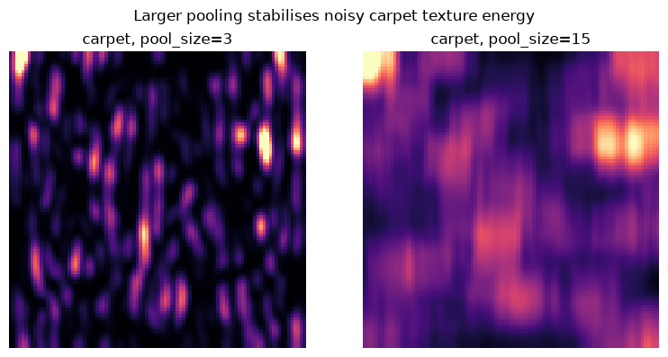

**Figure** Comparison of Gabor energy maps using pool sizes 3 and 15 for carpet texture.

Case when large pooling erases small features: Color defect on wood texture. If the pooling window is much larger than the scratch, then the scratch's energy will be diluted with surrounding pixels. 
For the defect centre marked with x, at pool_size=3, the Gabor-energy map shows a clear, localized bright spot. Whereas at pool_size=21, defect's response has been diluted by the box filter.

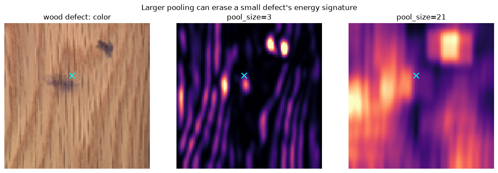

**Figure** Comparison of Gabor energy maps using pool sizes 3 and 21 for wood texture with color defect.

#### Question 2
Used grid texture. Nearest-direction NMS breaks each ring into disconnected fragments, while interpolated NMS keeps each ring as one continuous loop. Nearest-direction NMS can only compare each pixel against neighbors along 4 fixed directions, but a ring has edge pixels pointing in every direction around its circumference. Directions not in the 4 fixed directions get suppressed. Interpolated NMS uses the exact angle via bilinear_sample, allowing it to keep the loop continuous.

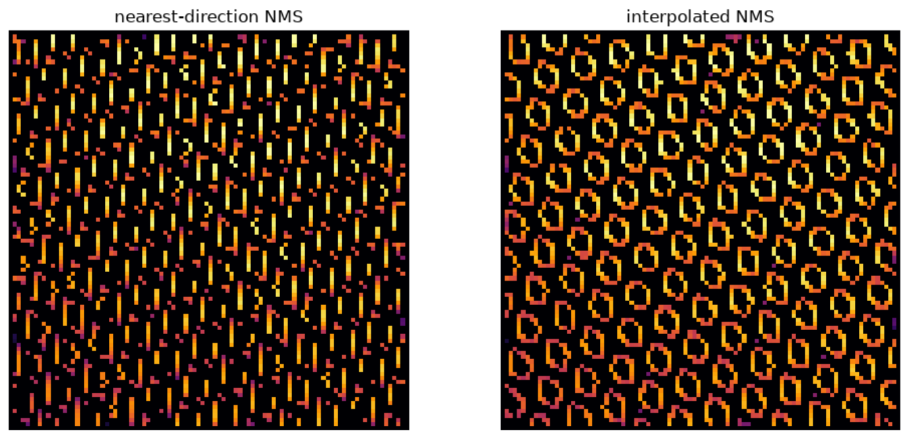

**Figure** Nearest_direction NMS and Interpolated NMS for grid texture.

The histogram compares the distribution of surviving positive NMS values for both methods. Interpolated NMS retains a higher pixel count than nearest-direction NMS across most bins, particularly in the 0.06–0.09 range. This is consistent with the ring-fragmentation effect observed earlier. 

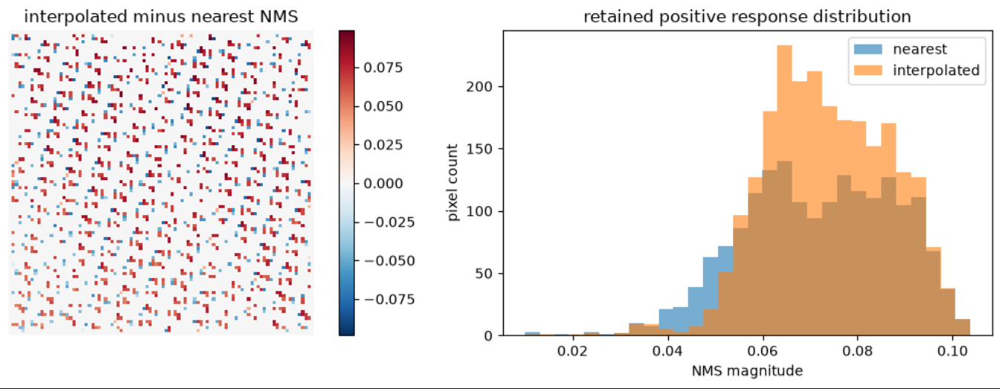

**Figure** Retained positive response distribution for grid texture.

For the same grid texture image, in 8-connectivity edges, the rings are mostly complete, closed loops. Whereas in 4-connectivity edges, the same rings now have visible gaps. This is especially the case for diagonal portions of the ring.

 

**Figure** 8-Connectivity and 4-Connectivity for grid texture. 

### Task A: Material Classification
**Setup.** 
One descriptor per image was built with `extract_local_features` and `global_pool`. The `StandardScaler` + `LogisticRegression` pipeline was fitted on normal
MVTec training images only, [4 per material = 20 images]. It was evaluated on the full MVTec test split [248 images]

**Results.** 
Accuracy was 0.940 and macro-F1 was 0.929. 

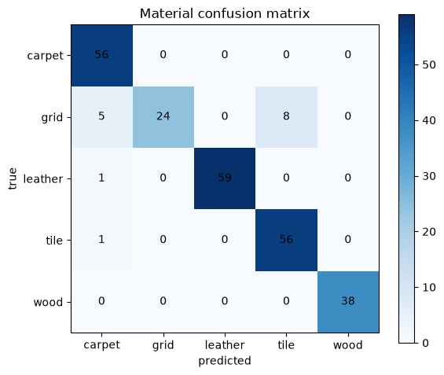

**Figure** Confusion Matrix 

Carpet and wood were classified perfectly. Leather and tile were nearly perfect (1 error each). Grid had recall of only 0.65: 5 grid images were predicted as carpet and 8 as tile.

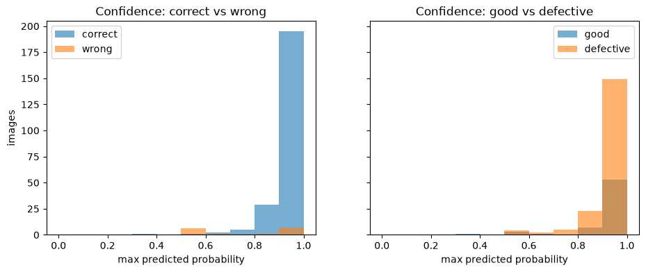 

**Figure** Confidence Histogram

On the left plot, most correct predictions are made with high confidence, concentrated in the 0.9-1.0 bin. Errors, however, split into two groups. Around half of the errors fall at 0.5-0.6 confidence and the other half occur at 0.9-1.0 confidence, so confidence alone cannot detect every mistake.

On the right plot, good and defective images have similar confidence distributions, with both concentrated at 0.9-1.0, consistent with their similar accuracy (0.938 vs 0.940). The larger defective bars reflect the larger number of defective test images (183 vs 65), not higher confidence. Defects therefore do not appear to reduce the classifier's confidence.

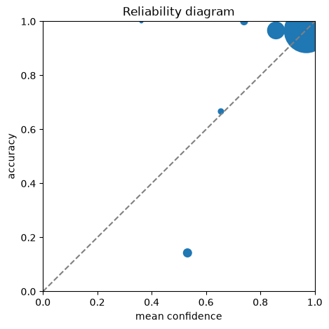

**Figure** Reliability Diagram

The largest bin (mean confidence ~0.95, accuracy~0.95) lies almost on the diagonal, and since it holds most of the test images. The overall calibration is good. The ~0.85 bin lies slightly above
the diagonal, the classifier is mildly under-confident there. The clear exception is the bin at mean confidence ~0.55, where accuracy was only ~0.15. Predictions in this range are strongly over-confident. 

**Errors.**

Below are two examples of misclassification. 
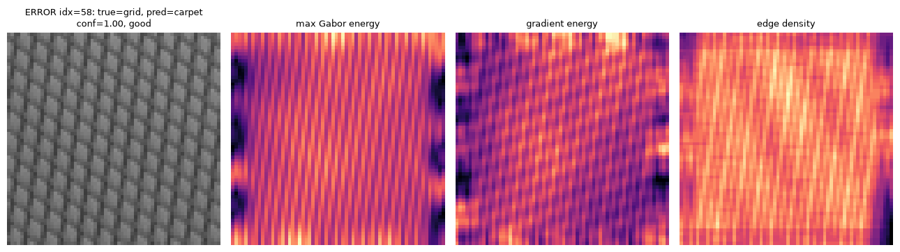 
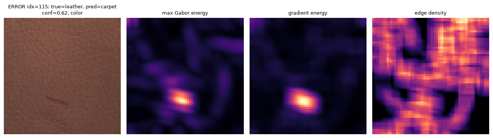 

**Figure** Errors with the source image and response maps

#### Question 3
Largest values are the color channels (channels 0-2), where RGB is stored on 0 - 1 scale. Smallest values includes gabor channels (channels 11-14), such as those in the higher frequencies which might be due to the relatively smooth and low-frequency texture of wood and the gradient energy (channel 15), which is computed as a pooled energy. Scaling is required as a linear classifier will penalize cofficient magnitude uniformly across all features. Scaling helps to prevent cases where classifier underuses informative but small scale channels because of their units not their actual predictive value. 

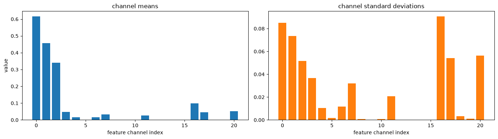

**Figure** Feature Channel Scale Comparison.

#### Question 4
Accuracy for good images: 0.938

Accuracy for defect images: 0.940

Classifier is not less accurate on images with defects. 

The confident error idx=58 is a good grid image predicted as carpet with confidence 1.00. The below image shows its response maps against a correctly classified grid and carpet. Its edge-density map is dense across the whole image, like the carpet, whereas the grid reference has near-zero edge density over its top half. Its max-Gabor map shows strong regular stripes everywhere, and its gradient energy is spread evenly across the image.

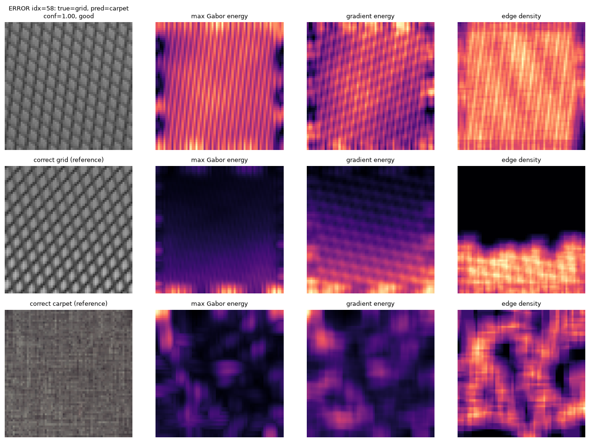 

**Figure** Example of a High Confidence Error.

### Task C
**Setup.** 
We used 520 training and 520 validation images from DTD split 1 to predict 13 texture attributes. Images were resized to 64×64, features were extracted using Gabor, colour, gradient and edge features. A separate logistic regression model was trained for each attribute.

**Results.**
| Attribute | Average Precision (AP) | F1 Score |
|---|---:|---:|
| banded | 0.428 | 0.459 |
| blotchy | 0.193 | 0.000 |
| braided | 0.144 | 0.000 |
| bumpy | 0.159 | 0.043 |
| cracked | 0.122 | 0.000 |
| fibrous | 0.131 | 0.000 |
| grid | 0.252 | 0.237 |
| marbled | 0.214 | 0.000 |
| pitted | 0.081 | 0.000 |
| porous | 0.111 | 0.000 |
| stained | 0.178 | 0.068 |
| striped | 0.558 | 0.554 |
| woven | 0.334 | 0.179 |

The heatmap below shows the average predicted probability for each attribute, for images grouped by their primary label. The diagonal is highest for striped (0.50) and banded (0.35), moderate for grid and woven (0.24) and stained (0.21). Whereas braided, bumpy, fibrous, pitted and porous are much lower. Related regular patterns are confused: banded images receive a grid score of 0.21, and grid images receive striped (0.14) and woven (0.15) scores.

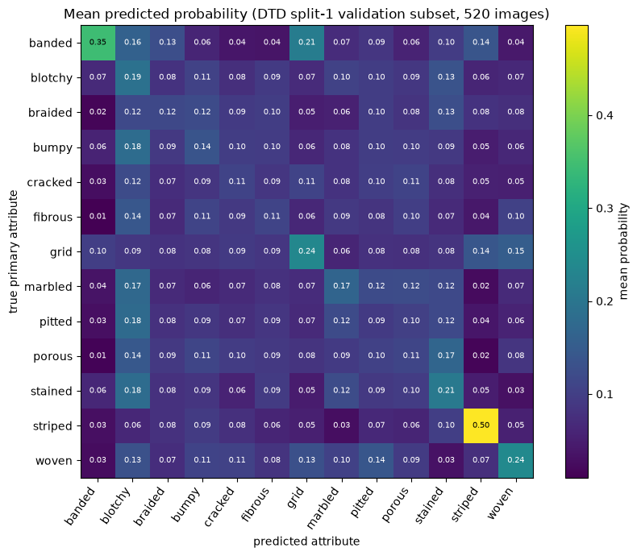 

**Figure** Probability Heatmap.

**Qualitative examples**
Selected from the first validation image per primary class. 

Example 1: (Success)
A banded image (labels: banded, striped) received banded p = ~0.80, above all other terms. It consists of thick, sharply separated vertical bands, producing strong, regular edges. However, stained received second highest with p = ~ 0.18. 
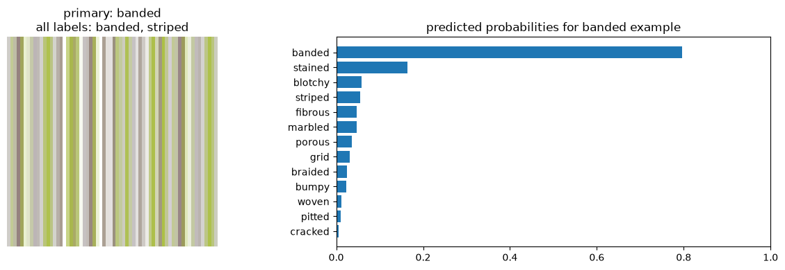

Example 2: (High Scoring Error)
A striped image (labels: striped) recieved stained p = ~0.50, against striped p = ~0.08. The image contains large smooth colour regions of orange and blue next to fine surface ridges. The model may be reading the large colour regions as a stain-like pattern, while the stripes, which are curved and unevenly spaced, give weaker evidence.
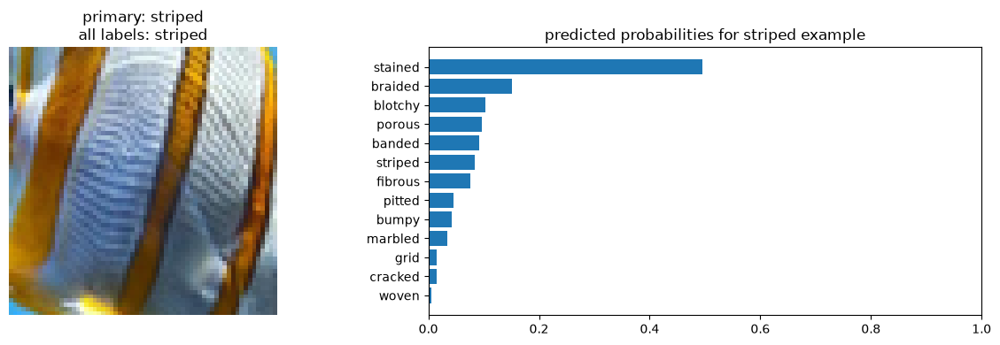

Example 3: (With No Clear Evidence)
A stained image (labels: stained) received braided p = ~0.17 against stained p = 0.15, with every other score having a similar p. Model has no strong evidence for a certain term. Patterns of irregular dark and light patches would more generic features that resemble several terms. 

**Which attributes map to measurable evidence?**
Table: Average Precision by Feature Family for Each DTD Texture Attribute
| Attribute | Colour | Gabor | Gradient |  Edge | All Features |
| --------- | -----: | ----: | -------: | ----: | -----------: |
| banded    |  0.213 | 0.310 |    0.209 | 0.577 |        0.428 |
| blotchy   |  0.149 | 0.162 |    0.139 | 0.160 |        0.193 |
| braided   |  0.124 | 0.188 |    0.136 | 0.102 |        0.144 |
| bumpy     |  0.128 | 0.143 |    0.153 | 0.087 |        0.159 |
| cracked   |  0.092 | 0.087 |    0.089 | 0.100 |        0.122 |
| fibrous   |  0.142 | 0.091 |    0.081 | 0.093 |        0.131 |
| grid      |  0.131 | 0.205 |    0.134 | 0.240 |        0.252 |
| marbled   |  0.183 | 0.155 |    0.135 | 0.097 |        0.214 |
| pitted    |  0.080 | 0.152 |    0.120 | 0.077 |        0.081 |
| porous    |  0.116 | 0.165 |    0.168 | 0.098 |        0.111 |
| stained   |  0.143 | 0.149 |    0.107 | 0.131 |        0.178 |
| striped   |  0.435 | 0.603 |    0.512 | 0.498 |        0.558 |
| woven     |  0.203 | 0.163 |    0.219 | 0.274 |        0.334 |

Edge features perform best for banded (0.577), grid (0.240), and woven (0.274), while Gabor performs best for striped (0.603). This is reasonable because these textures contain clear lines or repeated patterns. 
For some attributes, performance remains low across all feature families. Cracked, blotchy, bumpy, pitted and porous are close to chance, suggesting that our features do not capture their fine or irregular structures well.

#### Question 6
The descriptor contains colour, Gabor, gradient and edge features, summarised using mean, standard deviation and the 90th percentile. This captures colour variation, texture and edge information, which helps detect clear patterns such as striped (AP 0.558) and banded (AP 0.428) textures. 
However, global pooling removes spatial information, so location of features or how they are arranged are not included. This may explain the poor results for cracked, braided and porous textures. The 64×64 grayscale images and local averaging may remove fine details and shading.

## Results and Analysis Task D

## Results and Analysis Custom Photos

## AI-use disclosure table
[AI-CODE] [AI-DESIGN] [HUMAN-CHECK]
