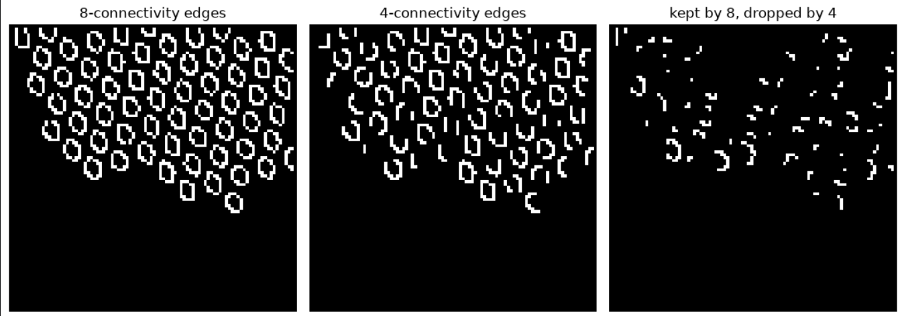

# CS4243 Lab 1 reference implementation report

This compact report records how every `YOUR CODE HERE` section is exercised. This is where you elaborate and explain your implementation and results you observed. Try to add visual/graphs and grounded reasoning to highlight your understanding.

## Gabor Implementation
## Edge Implementation
### Functions Explanation 
- bilinear_sample(image, y, x)
    - Find the pixel value at a coordinate that fall between pixels based on the four nearest pixels, through weighing how close the point is to each of the four pixels. 
- nms_interpolated(magnitude, direction)
    - Makes the edges thinner. So for every pixel, check the pixel just ahead and just behind it using the direction the edge is pointing across. bilinear_sample is used to compute these pixels. If pixel if stronger than those two neighbours, we keep it, otherwise we set it to 0. 
- adaptive_thresholds(nms, config)
    - Decides what count as strong edge and what counts as week edge. Instead of picking a fixed number, looks at the actual pixel values in the image and calculates good cutoff points, using either percentile or median-based method
- hysteresis(strong, weak, connectivity)
    - Connects broken edge lines. It starts at every strong edge pixel, then picks the neighbouring weak pixels, by checking either 4 or 8 neighbouring directions. If a weak pixel is connected to a strong one, keep it. Any weak pixel that isn't connected to a strong pixel gets thrown away.
## Features and Representations

## Normality Model

## Results and Analysis Task A-C
### Question 1
Frequency determines the how tightly spaced the sine wave inside the kernel, higher frequency is used to detect finer features. The orientation rotates the direction of the sin curve. A response map having an orientation matching the direction of the texture will give higher response. Phase shifts where along the stripe the peak of the sine wave sits. Different phases can detect the same stripe at slightly different positions. One phase might detect the middle of the stripe, while another might detect its edge. Pooling size controls how much spatial averaging is applied to the energy map after the kernel response is computed. A small pooling window keeps the energy map sharp and localized while larger pooling window averages energy over a bigger neighbourhood, smoothing out the noise. 

Case where large pooling increases stability: Carpet texture, since no two adjacent tufts will be identical even though the overall texture will be uniform. A large pooling window averages the noise away, giving a smooth and stable energy value. 
For the same filter kernel, when pool_size=3, there are lots of small and high-contrast bright blobs scattered everywhere. When pool_size=15, those same small blobs have merged into broader, lower-contrast regions. 

Case when large pooling erases small features: Color defect on wood texture. If the pooling window is much larger than the scratch, then the scratch's energy will be diluted with surrounding pixels. 
For the defect centre marked with x, at pool_size=3, the Gabor-energy map shows a clear, localized bright spot. Whereas at pool_size=21, defect's response has been diluted by the box filter.

### Question 2
Used grid texture. Nearest-direction NMS breaks each ring into disconnected fragments, while interpolated NMS keeps each ring as one continuous loop. Nearest-direction NMS can only compare each pixel against neighbors along 4 fixed directions, but a ring has edge pixels pointing in every direction around its circumference. Directions not in the 4 fixed directions get suppressed. Interpolated NMS uses the exact angle via bilinear_sample, allowing it to keep the loop continuous. 

The histogram compares the distribution of surviving positive NMS values for both methods. Interpolated NMS retains a higher pixel count than nearest-direction NMS across most bins, particularly in the 0.06–0.09 range. This is consistent with the ring-fragmentation effect observed earlier. 

For the same grid texture image, in 8-connectivity edges, the rings are mostly complete, closed loops. Whereas in 4-connectivity edges, the same rings now have visible gaps. This is especially the case for diagonal portions of the ring.

### Question 3
Largest values are the color channels (channels 0-2), where RGB is stored on 0 - 1 scale. Smallest values includes gabor channels (channels 11-14), such as those in the higher frequencies which might be due to the relatively smooth and low-frequency texture of wood and the gradient energy (channel 15), which is computed as a pooled energy. Scaling is required as a linear classifier will penalize cofficient magnitude uniformly across all features. Scaling helps to prevent cases where classifier underuses informative but small scale channels because of their units not their actual predictive value. 

## Results and Analysis Task D

## Results and Analysis Custom Photos

## AI-use disclosure table
[AI-CODE] [AI-DESIGN] [HUMAN-CHECK]
